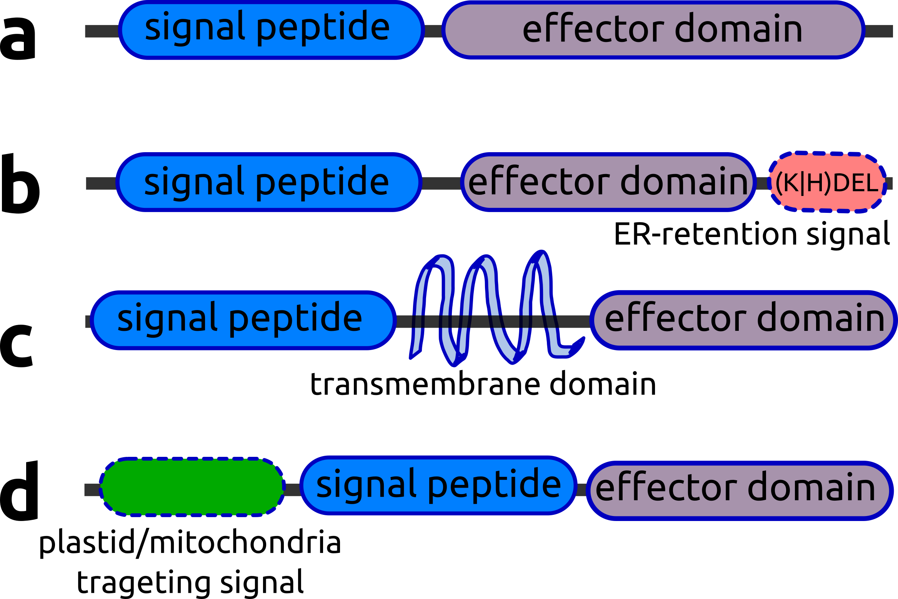
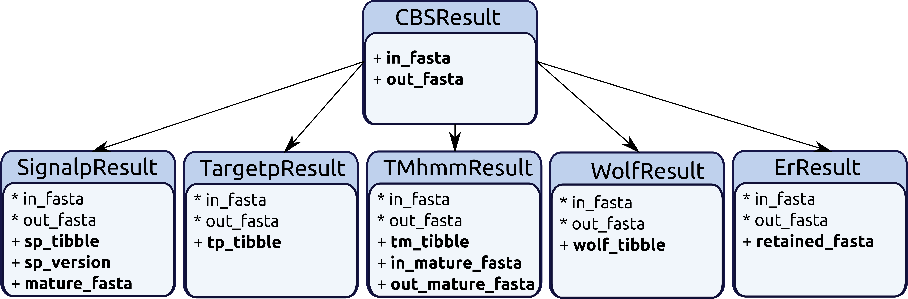
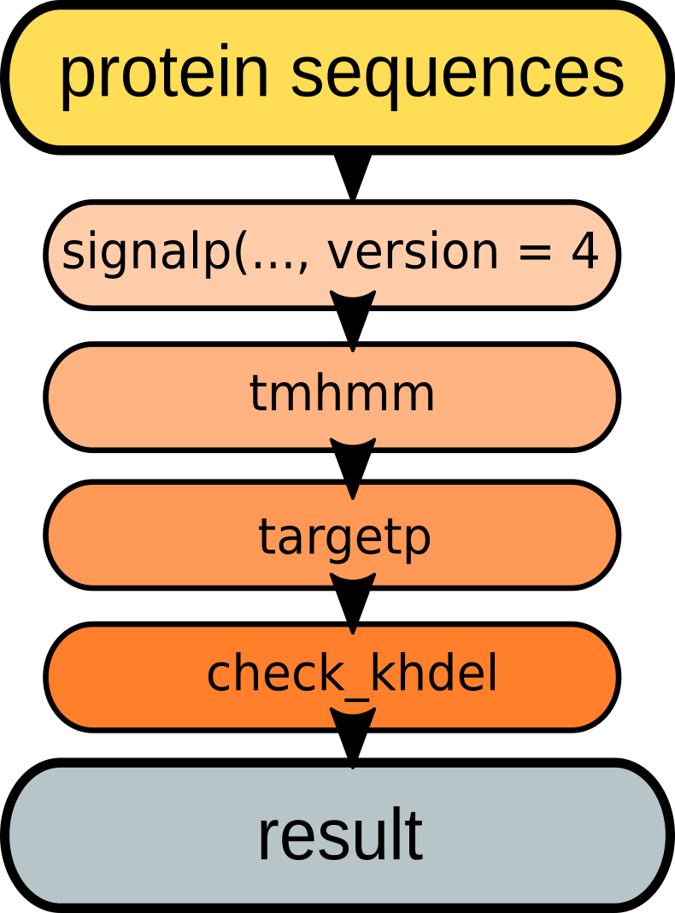
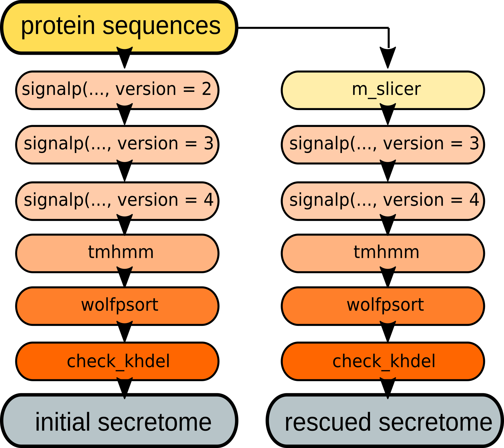

---
title: 'SecretSanta: flexible pipelines for functional secretome prediction'
author: "Anna Gogleva"
date: '`r Sys.Date()`'
output: rmarkdown::html_vignette
tables: yes
bibliographystyle: unsrt
bibliography: Santa.bib
vignette: >
    %\VignetteEngine{knitr::knitr}
    %\VignetteIndexEntry{SecretSanta vignette}
    %\usepackage[UTF-8]{inputenc}  
---  

## 1. Background
The **SecretSanta** package provides an R interface for the integrative
prediction of extracellular proteins that are secreted via classical pathways.

Secretome prediction often involves multiple steps. Typically, it starts with 
identification of short signal peptides at the N-terminal end of a protein
(**Figure 1 a**). Next, it is crucial to ensure the absence of motifs and
domains preventing the protein from being secreted or targeting it to 
specific organelles. Such sequences include transmembrane domains, short ER lumen
retention signals and mitochondria/plastid targeting signals
(**Figure 1 b-d**). The ultimate aim of a secretome prediction pipeline is to 
identify secreted proteins as shown in **Figure 1 a** and filter out
those shown in **Figure 1 b-d**.

\newline

```{r motifs, out.width = "400px", fig.align = "center", echo = FALSE}

```

> **Figure 1.** Characteristic motifs, domains and their arrangements, distinguishing extracellular proteins from proteins retained inside the cell.

\newline

A number of command line tools and web-interfaces are available to perform predictions of individual motifs and domains
([SignalP](http://www.cbs.dtu.dk/services/SignalP/),
[TargetP](http://www.cbs.dtu.dk/services/TargetP/),
[TMHMM](http://www.cbs.dtu.dk/services/TMHMM/),
[TOPCONS](http://topcons.net/),
[WoLF PSORT](https://github.com/fmaguire/WoLFPSort)), however the interface 
allowing to combine the outputs in a single flexible workflow is lacking.

\newline

The **SecretSanta** package attempts to bridge this gap. It provides a set of wrapper and parser
functions around existing command line tools for predictions of signal peptides
and protein subcellular localization. The functions are designed to work 
together by producing standardized output as an instance of ``CBSResult``
superclass.

\newline 

Objects of ``CBSResult`` class contain an ``in_fasta`` slot with 
the initial submitted sequences and an ``out_fasta`` slot with positive candidates after the method application. Within ``CBSResult`` class objects fasta slots are organised in `AAStringSetList`. `in_fasta` and `out_fasta` slots could be extracted separetely with designated accessor functions: `getInfasta` and `getOutfasta`. Alternatively, all fasta
slots could be extracted at once, organised in `AAStringSetList` object, with `getFastas` method. This enables application of all the defined `AAStringSetLisst` methods (e.g., `elementNROWS`) to the extracted object and ensures seamless integration
into numerous workflows, utilising this core Bioconductor class.
Example below illustrates basic manipulations with objects of `CBSResult` class. 
```{r CBSResult example, message = FALSE, echo = FALSE}
library(SecretSanta)
```

```{r}
aa <- readAAStringSet(system.file("extdata", "sample_prot_100.fasta", package = "SecretSanta"))

# create a simple CBSResult object:
inp <- CBSResult(in_fasta = aa,
                 out_fasta = aa[1:10])
class(inp)
inp
# access both fasta slots at once:
getFastas(inp)
# access in_fasta slot:
getInfasta(inp)
# access out_fasta slot:
getOutfasta(inp)
```

Each particular method then complements this simple class structure with relevant slots. For example, outputs of the ``signalp()`` function are organised in ``SignalpResult`` objects. Apart from ``in_fasta`` and ``out_fasta`` slots inherited from ``CBSResult`` class, ``SignalpResult`` objects contain three additional slots, relevant for the **SignalP** method:

+ ``sp_tibble`` - parsed **SignalP** tabular output for positive candidates;
+ ``mature_fasta`` - mature sequence for the candidate secreted proteins, i.e 
sequences with cleaved N-terminal signal peptides;
+ ``sp_version`` - version of **SignalP** used to generate this object.


The detailed organisation of class structure is shown in the **Figure 2**. 

```{r objects, out.width="600px", fig.align="center", echo=FALSE}

```

> **Figure2.** SecretSanta S4 class structure.

\newline

This uniform class organisation allows the user to easily pipe results between individual predictors to
create flexible custom pipelines and also to compare predictions between similar
methods. For instance, between **TargetP** and **WoLF PSORT** for subcellular 
localization and between multiple versions of **SignalP** for signal peptide prediction.

\newline

To speed-up processing of large input fasta files initial steps of the pipeline
are automatically run in parallel when the number of
input sequences exceeds a certain limit. The package also contains a convenience `ask_uniprot()` function - to export known information about subcellular localisation. This allows the user to compare and verify predictions of extracellular proteins, however is mostly applicable for well-annotated and curated genomes.

\newline

Taken together **SecretSanta** provides a platform to build automated multi-step secretome prediction pipelines that can be applied to large protein sets to
facilitate comparisons of secretomes across multiple species or under various conditions. For example, an earlier draft of this package was successfully used to compare the secreted protein complement of a plant pathogen throughout an infection time-course in plant roots [@Evangelisti2017].


\newline 

To avoid confusion, the names of external command line tools will
be shown in **bold**, and the corresponding R functions from the **SecretSanta**
package will have standard ``code highlighting``. For example:

+ **SignalP** - CBS SignalP and its associated derivative files;
+ ```signalp()``` - **SecretSanta** wrapper function around **SignalP**;

Majority of the **SecretSanta** functions could be run in 2 modes: 

+ ``starter`` - when initiating the secretome pipeline with the above
function;
+ ``piper`` - for downstream/intermediate steps, so that the function expects an
output from another wrapper function. For detailed information on piper/starter behaviour please see Table 2.

## 2. Installation of external dependencies

**SecretSanta** relies on a set of existing command line tools to predict secreted proteins. Please install them and configure according to the listed instructions. Due to limitations imposed by the external dependencies, some of **SecretSanta** wrapper functions are fully functional only on Linux systems.

\newline

### 2.1 Download and configure external dependencies

#### Tools for prediction of signal peptides and cleavage sites:
- **SignalP 2.0** 
    + This version can run under IRIX, IRIX64, Linux, OSF1, SunOS.
    + Download stand alone **SignalP 2.0**
    http://www.cbs.dtu.dk/cgi-bin/sw_request?signalp+2.0
    + Unpack the archive
    ```{sh unpack signalp-2.0, eval=FALSE}
    tar -zxvf signalp-2.0.Linux.tar.Z
    cd signalp-2.0
    ```
    + Edit "General settings" at the top of the **signalp** file. Set value 
    of 'SIGNALP' variable to be path to your **signalp-2.0** directory.
    Other variables usually do not require changes. We will not use plotting 
    functions from *SignalP*, so gnuplot, ppmtogif and ghostview are not required.
    For more details please check ``signalp-2.0.readme``.
    + Since we want to be able to run different versions of **SignalP**,
    including the legacy versions, it is important to be able to discriminate
    between them. R is oblivious to shell aliases, so we will simply rename the
    **signalp** script:
    
    ```{sh rename signalp2, eval = FALSE}
    mv signalp signalp2
    ```

\newline

- **Signalp 3.0** 
    + This version will run on the most common UNIX platforms.
    + Download stand alone **Signalp 3.0**
    http://www.cbs.dtu.dk/cgi-bin/sw_request?signalp+3.0
    + Unpack the archive
    ```{sh unpack signalp-3.0, eval=FALSE}
    tar -zxvf signalp-3.0.Linux.tar.Z
    cd signalp-3.0
    ```
    + Similar to **Signalp 2.0**, edit "General settings" at the top of the 
    **signalp** file. Set value of 'SIGNALP' variable to be path to your
    **signalp-3.0** directory. Other variables usually do not require changes. 
    For more details please check ``signalp-3.0.readme``.
    + Rename **signalp** script to avoid further confusion between the versions:
    ```{sh rename signalp3, eval = FALSE}
    mv signalp signalp3
    ```
    
\newline

- **SignalP 4.1** - the most recent version
    + This version can run under Windows, OS X (Macintosh) and Linux.
    + Download stand alone **SignalP 4.1** 
    http://www.cbs.dtu.dk/cgi-bin/nph-sw_request?signalp
    + Unpack the archive
    ```{sh unpack signalp-4.1, eval = FALSE}
    tar -zxvf signalp-4.1.Linux.tar.Z
    cd signalp-4.1
    ```
    + Edit "General settings" at the top of the **signalp** file. Set values for
    'SIGNALP' and 'outputDir' variables. For more details please check
    ``signalp-4.1.readme``.
    + Rename **signalp** script to avoid further confusion between the versions:
    ```{sh rename signalp4, eval = FALSE}
    mv signalp signalp4
    ```

\newline

#### Tools for prediction of protein subcellular localization:    
    
- **TargetP 1.1**
    + **TargetP 1.1** will run on the most common UNIX platforms  
    + Download stand alone **TargetP 1.1**:
    http://www.cbs.dtu.dk/cgi-bin/nph-sw_request?targetp
    + Unpack the archive:
    ```{sh unpack targetp-1.1, eval = FALSE}
    tar -zxvf targetp-1.1b.Linux.tar.Z 
    cd targetp-1.1
    ```
    + Edit the paragraph labeled "GENERAL SETTINGS, customize" at the top of 
    the **targetp** file.
    Set values for 'TARGETP' and 'TMP' variables. Ensure, that the path to
    **TargetP** does not exceed 60 characters, otherwise **TargetP 1.1** might fail.

\newline

- **WoLF PSORT**
    + Clone **WoLF PSORT**
    ```{sh, download WoLFPSort, eval = FALSE}
    git clone https://github.com/fmaguire/WoLFPSort.git
    cd WoLFPSort
    ```
    + Copy the binaries from the appropriate platform specific binary directory
    ```./bin/binByPlatform/binary-?``` to ```./bin/```
    + For more details please check the ```INSTALL``` file.
    + The most important script we need **runWolfPsortSummary** has a bulky name, we will rename it to **wolfpsort** for future convenience:
    ```{sh rename wolf, eval = FALSE}
    mv runWolfPsortSummary wolfpsort
    ```

\newline

#### Tools for predicting transmembrane domains
- **TMHMM 2.0**
    + *TMHMM 2.0** will run on the most common UNIX platforms  
    + Download stand alone tmhmm 
    (http://www.cbs.dtu.dk/cgi-bin/nph-sw_request?tmhmm)
    + Unpack the archive:
    ```{sh, unpack tmhmm-2.0, eval = FALSE}
    tar -zxvf tmhmm-2.0c.Linux.tar.gz
    cd tmhmm-2.0c
    ```
    + Set correct path for Perl 5.x in the first line of ```bin/tmhmm``` and
    ```bin/tmhmmformat.pl``` scripts.
    + For more details please check the ```README``` file.
    
\newline

### 2.2 Organise access to the external dependencies

Two options are possible:

#### Option A: all the external dependencies are accessible from any location.
If you follow this route, there will be no need to provide paths to the respective tool when running **SecretSanta** functions. For bash users this requires modification of ``$PATH`` environment variable. To make the change permanent, edit ``.profile``:

Open ./profile:
```{sh edit $PATH, eval = FALSE}
gedit ~/.profile
```

Add a line with all the path exports.
In this example all the dependencies are installed in the `my_tool` directory:
```{sh, eval = FALSE}
export PATH=
"/home/my_tools/signalp-4.1:\
/home/my_tools/signalp-2.0:\
/home/my_tools/signalp-3.0:\
/home/my_tools/targetp-1.1:\
/home/tmhmm-2.0c/bin:\
/home/my_tools/WoLFPSort/bin:\
$PATH"
```

Reload ``.profile``:
```{sh, eval = FALSE}
. ~/.profile
```
Reboot to make changes visible to R. 

If you are using csh or tsh instead of bash, edit ``.login`` instead of ``.profile`` and use the ``setenv`` command instead of ``export``.

To check that all the tools are installed correctly, we will use ``manage_paths`` function, it runs small test jobs to verify that all the external dependencies are functional and will not cause downstream problems. 

```{r real load SecretSanta, message=FALSE}
library(SecretSanta)
```
To run checks for all the dependencies:
```{r check_paths_in_path, echo = TRUE, collapse = TRUE, eval = FALSE}
check1 <- manage_paths(in_path = TRUE)
```
It is also possible to run just a single test for a specific dependency in question:
```{r check_paths_in_path_single, echo = TRUE, collapse = TRUE}
check1 <- manage_paths(in_path = TRUE, test_tool = 'signalp2')
```

#### Option B: paths to external dependencies are supplied in a separate file:
This option should be used when ``$PATH`` variable can not be modified. If you follow this route, please specify path to the respective tool executible when running individual wrappers via ``paths`` argument.

To supply all the paths at once, create 
a 2-column space-separated text file without headers with listed full paths for all the external dependencies. Please note, when providing path file you can avoid renaming executable for multiple versions of **SignalP**.

```{r paths example, echo = FALSE}
pp <-
    suppressMessages(read.table(
    system.file("extdata", "santa_paths",
    package = "SecretSanta"),
    sep = ' ',
    header = FALSE
    ))
    names(pp) <- c('tool', 'path')
    
    knitr::kable(pp,
    format = 'pandoc',
    caption = "**Table1**: Sample paths to external dependencies")
```

For external tool names please use simple character strings without version numbers. The only exception here are different versions of **SignalP**, which require version number in one-digit format in the ``tool`` column to be distinguishable.

Now, we can check the dependecies using ``manage_paths()`` function. In this case we need to provide value for the ``path_file`` argument and set ``in_path = FALSE``. Note: ```manage_paths()``` is case insensitive and will convert all the tool names provided in the file to the lower case. 

```{r check_path_in_file, echo = TRUE, collapse = TRUE, eval = FALSE}
check2 <- manage_paths(
    in_path = FALSE,
    path_file = system.file("extdata",
    "sample_paths",
    package = "SecretSanta")
    )
```

## 3. Individual methods

### 3.1 Signalp

**SignalP** is a software tool to predict classical signal peptides and 
cleavage sites [@Nielsen1997] in eukaryotes and bacteria. The method combines
prediction of signal peptides and cleavage sites based on a combination of
artificial neural networks and hidden Markov models. The latter can distinguish between signal peptides and non-cleaved signal anchors 
[@Nielsen1997].

Currently ```signalp()``` function from **SecretSanta** provides an interface for the three recent versions of  **SignalP**.
Bu providing access for legacy versions of **SignalP** - 2.0 [@Nielsen1998] and 3.0 [@Bendtsen2004], we allow the user to perform comparissons with already existing secretome datasets, predicted with the same method versions. The most recent **Signalp 4.1** [@Petersen2011] version, applied with default thresholds could be not sensitive enough to predict certain classes of secreted oomycete and fungal effectors [@Sperschneider2015]. Similar, to the web-service and command line tool, there is a way to run **signalp** in the sensitive mode when 4.1 version is used, by specifying ``sensitive = TRUE``.

``signalp()`` requires providing ``organism`` argument; possible values include:

+ *'euk'* - for eukaryotes;
+ *'gram+'* - for gram-positive bacteria;
+ *'gram-'* - for gram-negative bacteria.

When legacy versions of **SignalP** are used, 2.0 and 3.0, please provide a value for the ``legacy_method`` argument. There are two possible options, often producing quite different results:

+ *'hmm'* - for HMM-based predictions;
+ *'nn'* - for predictions based on neural networks.

To run ``signalp()`` prediction, first read fasta file with amino acid sequences and store its contents in a separate variable:
```{r read aa fasta, }
aa <- readAAStringSet(system.file("extdata", "sample_prot_100.fasta",
                                    package = "SecretSanta"))
```
Initialize object of ``CBSResult`` class with ``aa`` as ``in_fasta`` slot.
```{r initialise CBSResult, cache=FALSE}
inp <- CBSResult(in_fasta = aa)
inp
```
Since this is the first step in our secretome prediction pipeline, we will run ``signalp()`` in a *starter* mode. Here we select version number 2
(**SignalP 2.0**) and assume that signalp is accessible globally, so no path 
files should be specified. If **SignalP 2.0** can not be accessed globally, please provide a relevant path via ``paths`` argument. For more details please see [**Option B**](). Please note that ``signalp()`` truncates all the input sequences longer than 2000 a.a, by default. In this case '_truncated' is added to the original sequence ids to keep track of the changes. An alternative option is to discard long sequences completely before the analysis, to do so set ``truncate = FALSE`` when running ``signalp()``.

```{r run signalp2,  collapse = TRUE, }
step1_sp4 <- signalp(inp, version = 4,
                    organism = 'euk',
                    run_mode = "starter")
```

The above code under the hood runs **SignalP 4.1** and outputs result as an instance of ```SignalpResult``` class, which inherits from a parental ``CBSResult()``class.

```{r explain SignalpResult class}
class(step1_sp4)
```

The ```SignalpResult``` object contains 5 slots:

+ ``in_fasta`` - original set of input amino acid sequences;

+ ``out_fasta`` - full length amino acid sequences of positive candidates;

+ ``mature_fasta`` - mature sequence for the candidate secreted proteins, i.e sequences with cleaved N-terminal signal peptides;

+ ``sp_tibble`` - parsed **SignalP** tabular output for positive candidates;

+ ``sp_version`` - version of **SignalP** used to generate this object. 


You can use accessor methods to get contents of individual fasta slots:

```{r get indiv fasta}
getInfasta(step1_sp4)
getOutfasta(step1_sp4)
getMatfasta(step1_sp4)
```

Alternatively, all the fasta slots could be also retrieved at once with `getFastas` method, inherited from ``CBSResult`` class:

```{r get all fastas}
getFastas(step1_sp4)
```

The remaining slots could be accessed with the designated methods:
```{r showcase all other accessors for SignalpResult object}
getSPtibble(step1_sp4)
getSPversion(step1_sp4)
```

Next, imagine we would like to run all the **SignalP** versions on the same input for comparison. We can do this by simply changing value of the ``version`` argument: 

```{r run signalp3 and 4, collapse = TRUE, }
step1_sp3 <- signalp(inp, 
                    version = 3,
                    organism = 'euk',
                    run_mode = "starter",
                    legacy_method = 'hmm')
step1_sp2 <- signalp(inp,
                    version = 2,
                    organism = 'euk',
                    run_mode = "starter",
                    legacy_method = 'hmm')
step1_sp4 <- signalp(inp,
                    version = 4,
                    organism = 'euk',
                    run_mode = "starter")
```
In this case application of **SignalP 4.1** version resulted in fewer candidates. Please note, that despite differences in the output format generated by multiple versions of **SignalP**, ``signalp()`` returns ``sp_tibble`` in a standard format.

To pipe results from different versions of **SignalP** just switch to
the ``run_mode = 'piper'`` for the second and other downstream steps. In this case ``signalp()`` will run the analysis using contents of ``out_fasta`` slot as an input.
Say, we want to do the following piping:
**signalp2** -> **signalp3** -> **signalp4**.

\newline

We will re-use the ``step1_sp4`` object generated earlier in the ``starter`` mode for the **signalp4** -> **signalp3** piping operation:

```{r signalp piper sp2->sp3, collapse = TRUE}
step2_sp3 <- signalp(step1_sp2,
                    version = 3,
                    organism = 'euk',
                    run_mode = 'piper',
                    legacy_method = 'hmm')
```

Similar with the **signalp3** -> **signalp4** piping:

```{r signalp piper sp3 -> sp4, collapse = TRUE}
step3_sp4 <- signalp(step2_sp3,
                    version = 4,
                    organism = 'euk',
                    run_mode = "piper")
```

With the input fasta files containing more than 1000 sequences, ``signalp()`` 
will automatically switch to parallel mode. It will split the input into 
smaller chunks and run prediction as a massive parallel process using
specified number of CPUs (see ``cores`` argument). Execution time depends on the number of CPUs available and the input file size. With 48 CPUs it takes ~2 minutes to run ``signalp()`` on the input fasta file with more than 40'000 sequences.

### 3.2 Tmhmm
**TMHMM** predicts transmembrane a-helices and identifies integral
membrane proteins based on HMMs [@Krogh2001; Sonnhammer1998]. It is important
to exclude proteins with transmembrane domains located after signal peptide, as
they will be retained in the membrane. Since **TMHMM** is often unable to
distinguish between N-terminal signal peptides and transmembrane domains, it is
recommended to run ``tmhmmm()`` on the mature sequences obtained after running 
``signalp()`` function.

``tmhmm()`` function can handle input objects of ``SignalpResult`` class with 
non-empty ``mature_fasta`` slot.

Here we will use output of the ``signalp()`` as an input for ``tmhmm()``:

```{r tmhmm legal, collapse=TRUE, cache=FALSE}
tm <- tmhmm(step1_sp4, TM = 0)
```
Attempts to run ``tmhmm()`` on the ``CBSResult`` object lacking ``mature_fasta`` slot will produce an error:

```{r tmhmm illegal, collapse=TRUE, error=TRUE}
tm2 <- tmhmm(inp, TM = 0)
```

``tmhmm()`` outputs instances of ``TMhmmResult`` class, also inheriting from 
``CBSResult``.

```{r explain TMhmmResult class}
class(tm)
tm
```

``TMhmmResult`` object contains 5 slots:

+ ``in_fasta`` and ``out_fasta`` are common slots of all classes 
inheriting from the ``CBSResult`` class;
+ ``in_mature_fasta`` - mature sequences used as an input for ```tmhmm```
+ ``out_mature_fasta`` - outputted mature sequences not having more 
transmembrane domains than specified by ``TM`` threshold.
+ ``tm_tibble`` - parsed **tmhmm** tabular output for candidates not having more
transmembrane domains than specified by ``TM`` threshold;

To get contents of individual slots you could use accessor functions:

```{r accessors for TMhmmResult class}
getTMtibble(tm)
getInMatfasta(tm)
getOutMatfasta(tm)
getFastas(tm)
```

### 3.3 Topcons
**SecretSanta** provides a way to use an alternative method for prediction of transmembrane domains - TOPCONS [REF], which uses consensus prediction of multiple tools (Phillius [REF], PolyPhobius [REF], SPOCTOPUS [REF], OCTOPUS [REF], SCAMPI [REF]) and can more accurately discriminate between signal peptides and transmembrane regions [REF]. Currently there are several options to run TOPCONS: using a [web-server](http://topcons.net/), [WSDL-API scripts](http://topcons.net/pred/help-wsdl-api/) or [stand-alone version](https://github.com/ElofssonLab/TOPCONS2). Since it takes considerable time to run TOPCONS predictions for a full proteome (from few hours to few days), it makes direct integartion of this method in **SecretSanta** wraper framework not so optimal. Instead we have implemented a parser function ``topcons()``, which converts pre-computed TOPCONS output into to a compatible `CBSResult` object and can be pluged-in in versatile **SecretSanta** pipelines.

In the example below, we will use precomputed TOPCONS result to convert to a ``TopconsResult`` object, again inheriting from ``CBSResult``:

```{r}

```


Since TOPCONS method itself takes quite a while to run for large protein datasets, ``topcons()`` is restricted to `piper`-like behaviour. 


### 3.4 Targetp
**Targetp** predicts the subcellular localization of secreted eukaryotic proteins based on the presence of signal peptide (SP), chloroplast transit peptides (cTP) or mitochondrial targeting peptides (mTP) in the N-terminus [@Emanuelsson2008]. 
Including **targetp** in the pipeline can provide additional evidence that a 
protein with a predicted signal peptide is not targeted to plastids or
mitochondria and is indeed extracellular. The ``targetp`` function accepts input objects belonging to the ``CBSResult`` class uses `out_fasta` slot as a direct input to the **targetp** method, i.e, predictions are based on the full
protein sequences, not their mature versions.

``targetp`` requires specifying ``network_type`` to run correctly. Possible 
values include:

- *'P'* - for plants;
- *'N'* - for non_plants.

It is possible to run ``targetp`` in both *piper* and *starter* modes.
Imagine, we want to start our pipeline by running ``targetp`` using already
created ``inp`` object as an input:

```{r tatgetp starter, collapse = TRUE, cache=FALSE}
tp <- targetp(inp,
        network = 'N',  # for non-plant networks
        run_mode = 'starter')
```

Alternatively, we can run targetp on the output of other functions, for example
``signalp`` in the *piper* mode:

```{r targetp piper, collapse = TRUE, cache=FALSE}
tp_pipe <- targetp(step1_sp2,
                    network = 'N',
                    run_mode = 'piper')
```

In both cases ``targetp`` will output an object of ``TargetpResult`` class with 
the following slots:

```{r explain TargetpResult class}
class(tp)
slotNames(tp)
```

+ ``in_fasta`` and ``out_fasta`` are common attributes of all classes 
inheriting from ``CBSResult`` class;
+ ``tp_tibble`` - parsed tragetp tabular output for candidates not targeted
to mitochondria or plastids, i.e most likely to be secreted.

To access the ``tp_tibble`` slot use the ``getTPtibble`` method:
```{r access tp_tibble}
getTPtibble(tp)
```

``targetp`` will automatically switch to a parallel mode if the number of input
sequences is greater than 1000.

### 3.5 Wolfpsort
**WoLFPSORT** - predicts protein subcellular localization based on the PSORT
principle. It converts amino acid sequences into numerical localization 
features based on sorting signals, amino acid composition and functional motifs.
The converted data is then classified based on k-nearest neighbor algorithm 
[@Horton2006].

``wolfpsort`` requires ``organism`` parameter. Possible values include:

- *'plant'*;
- *'animal'*;
- *'fungi'*.

The ``wolfpsort`` function accepts objects of ``CBSResult`` class, and could be
run in both `starter` and `piper` modes.

```{r run wolfpsort, collapse = TRUE, cache=FALSE}
wlf <- wolfpsort(step1_sp2, organism = 'fungi', run_mode = 'piper')
```

``wolfpsort`` returns an object with 3 slots:

```{r explain WolfpsortResult class}
class(wlf)
slotNames(wlf)
```
+ ``in_fasta`` and ``out_fasta`` are common attributes of all classes 
inheriting from ``CBSResult`` class;
+ ``wolf_tibble`` - parsed WoLFPsort tabular output for sequences with 
'extracellular' predicted to be the most probable subcellular localization.

To access contents of the ``wolf_tibble`` slot use ``getWOlFtibble`` method:
```{r access wolf_tibble}
getWOLFtibble(wlf)
```

Since ``wolfpsort`` has the same purpose as ``targetp`` it might be useful to
run these functions side by side to compare the obtained results
(see [targetp results](#Targetp)).

### 3.6 Check the presence of terminal ER-retention motifs
In addition to having signal peptides, some proteins have an ER-retention 
signal in the C-terminal domain that prevents protein from being secreted outside the cell. There are at least 2 known ER-retention motifs (*KDEL* and *HDEL*) [@Munro1987]. There are several models of ER-retention signal, ``check_khdel`` function allows the user to
specify one of 3 possible definitions with `pattern` argument:

- `pattern = 'prosite'` - checking for ER-retention motifs defined as ["[KRHQSA][DENQ]EL$>"](http://prosite.expasy.org/PDOC00014);
- `pattern = 'elm'` - checking for ER-retention motifs defined as ["[KRHQSAP][DENQT]EL$](http://elm.eu.org/elms/TRG_ER_KDEL_1);
- `pattern = 'strict'` - strict mathcing for N-termial *KDEL* or *HDEL* motifs;


The ``check_khdel`` function uses pattern matching, according to the specified definition to scan amino acid sequences and remove those with an ER retention signal in the C-terminus. To run
it, simply pass a ``CBSResult`` object as an input.  
``check_khdel`` function is restricted to piper-like behaviour, because it makes the most sence to check for ER-retention signals in proteins with already predicted signal peptides.
The function does not rely on external dependencies, so providing path container is not required.

```{r check ER retention, collapse = TRUE, cache = FALSE}
er_result <- check_khdel(step1_sp2, pattern = 'prosite')

```
This will return an object with 3 slots:

```{r explain ErResult class}
slotNames(er_result)
```
+ ``in_fasta`` and ``out_fasta`` are common attributes of all classes 
inheriting from ``CBSResult`` class;
+ ``retained_fasta`` - all the sequences with C-terminal '(K/H)DEL' motifs, in case 
you would like to have a look at them.

### 3.7 M-slicer

This is an experimental option. The ``m_slicer`` function takes the input amino acid sequences and generates all possible subsequences starting with methionine based on the assumption that translation start sites might be mis-predicted in the original set of proteins, which in turn would result in signal peptides also being mis-predicted. The output of this step can be used as an input for secretome prediction pipelines to rescue secreted proteins with mis-predicted start sites. (Making a list and checking it twice...just like Santa does). Sequence ids for the newly generated slices are built by concatenating original sequence ids, 'slice' string and position of the methionine sliced from. For example: 
``ALI_PLTG_3_slice_M86`` means that ``ALI_PLTG_3`` sequence was sliced starting
from the methionine in the position 86.

``m_slicer`` has 2 running modes:

+ ``slice`` - to simply slice input fasta regardless of it's origin;

```{r m_slicer slice, cache=FALSE}
slice <- m_slicer(aa,  # a set of amino acid seqeunces
                run_mode = 'slice',
                min_len = 100 # minimal length of the outputed slices
)
```

+ ``rescue`` - having output from any other up-stream function it extracts 
proteins not predicted to be secreted on the initial run and generate slices for
them.

```{r m_slicer rescue, cache=FALSE}
rescued <- m_slicer(step1_sp2,  # signalp2 output
                run_mode = 'rescue',
                min_len = 100)
```

Results of both run modes could be used as an input for other ``SecretSanta`` 
predictors. Say, we want to run ``signalp`` on the rescued proteins. Note, that 
``m_slicer`` outputs ``AAStringSet`` objects, so in order to pass it to
``signalp`` we first need to create ``CBSResult`` object with 
``in_fasta = rescued``.

```{r signalp for rescued proteins, collapse = TRUE, cache=FALSE}
r_inp <- CBSResult(in_fasta = rescued)
sp_rescue <- signalp(r_inp,
                    version = 2,
                    organism = 'euk',
                    run_mode = 'starter',
                    truncate = TRUE,
                    legacy_method = 'hmm')
```
The slicing procedure returned 15 additional potentially secreted candidates.

## 4. Pipers and/or starters

Here is a short summary of individual methods available via the **SecretSanta**
package:

```{r starters_pipers, echo = FALSE}
st <- suppressMessages(read.table(system.file("extdata",
                                    "summary_tools.csv",
                                    package = 'SecretSanta'),
                        sep = ',', header = TRUE))

knitr::kable(st, align = c(rep('c', 2), 'l', rep('c',3)),
                caption = "**Table2**: Individual methods summary.")
```

## 5. Build pipelines

We are now ready to build a pipeline using all of our available methods. 
Say, we would like to have a relatively short pipeline (**Figure 3**) with the
following analytic steps:

+ use **signalp4** to predict signal peptides and cleavage sites;
+ run **tmhmm** on the output, to ensure that predicted proteins with
signal peptides do not contain TM domains, i.e won't be stuck in the membrane;
+ run **targetp** on the output, to make sure that a set of selected proteins
is not targeted to plastids or mitochondria;
+ collect the targetp output and scan for ER-retention signals - to ensure
that proteins won't be stuck in the ER.


```{r pipe1, out.width = "200px", fig.align="center", echo = FALSE}

```

> **Figure 3**: Minimal pipeline for secretome prediction

Now we will run this pipeline using ``SecretSanta`` functions, starting with
``aa`` - an ``AAStringSet`` object containing 100 amino acid sequences.

#### Step 1: predict signal peptides

```{r, collapse = TRUE}
input <- CBSResult(in_fasta = aa)

input
step1_sp4 <- signalp(input,
                    version = 4,
                    organism = 'euk',
                    run_mode = 'starter',
                    truncate = TRUE
                    )

getSPtibble(step1_sp4)

getOutfasta(step1_sp4)

getMatfasta(step1_sp4)
```

***
> **Result**: 5 candidate proteins with signal peptides.

#### Step 2: check for presence of TM domains in mature peptides:

```{r, collapse = TRUE}
# we allow 0 TM domains in mature peptides
step2_tm <- tmhmm(step1_sp4, TM = 0)

getTMtibble(step2_tm)

getOutfasta(step2_tm)

getOutMatfasta(step2_tm)

```

***
> **Result**: 5 candidate proteins with signal peptides; 0 TM domains in
mature sequences.

#### Step 3: predict sub-cellular localization
Here we are using ``targetp``, we could have also used ``wolfpsort``.

```{r, collapse=TRUE}
step3_tp <- targetp(step2_tm, network = 'N',run_mode = 'piper')

getTPtibble(step3_tp)

getInfasta(step3_tp)

getOutfasta(step3_tp)
```

This step allowed us to filter 1 sequence potentially targeted to mitochondria.

> **Result**: 4 candidate proteins with signal peptides; 0 TM domains in
mature sequences; not targeted to plastids or mitochondria.

#### Step 4: check for ER-retention signals

```{r, collapse = TRUE}
step4_er <- check_khdel(step3_tp, 'elm')
getOutfasta(step4_er)
```

***
> **Final Result**: 4 candidate proteins with signal peptides; 0 TM domains in
mature sequences; not targeted to plastids or mitochondria; not retained in ER.

This is an example of a fairly simple pipeline, but you can create more complex
ones. A more stringent pipeline might involve multi-step filtration on signal
peptide prediction as well as additional predictions for 'rescued'
(**Figure 4**) sequences.

```{r pipe2, out.width = "300px", fig.align="center", echo = FALSE}

```

> **Figure 4**: Example of a stringent pipeline.

#### Step 5: save the result secretome

```{r, echo = TRUE}
writeXStringSet(getOutfasta(step4_er), 'secretome_out.fasta')
```

#### Compact pipelienes:

Now, once we have examined all the individual analytic steps, we can directly combine them in a single command by using ``%>%`` operator:

```{r, echo = TRUE, collapse = TRUE}
pipeline <- signalp(input, version = 4, organism = 'euk', run_mode = 'starter') %>% 
    tmhmm(TM = 0) %>%
    targetp(network = 'N', run_mode = 'piper') %>%
    check_khdel(pattern = 'prosite')
```

Since ``pp`` belongs to the ``CBSResult`` class, we can again extract the output fasta field and save it in a separate file:

```{r, echo = TRUE, collapse = TRUE}
writeXStringSet(getOutfasta(pipeline), 'secretome_out.fasta')
```

## 6. Running pipelines on HPCs
Now we will download all available fungal proteomes using [``biomartr``](https://cran.r-project.org/web/packages/biomartr/index.html) package and apply the same standard secretome prediction pipleine. To speed-up the process, we will use 20 cores available on our local HPC. Please note, retrival of proteomes might take a while.

```{r, eval = FALSE}
library(biomartr)
meta.retrieval(kingdom = "fungi", db = "refseq", type = 'proteome', 
               path = "fungi_refseq_proteomes")

proteomes <- list.files("fungi_refseq_proteomes/",
                        full.names = TRUE, pattern ="*.fasta")

hpc_pipeline <- function(proteome) {
    input <- CBSResult(in_fasta = readAAStringSet(proteome))
    pipeline <- signalp(input, version = 4, organism = 'euk',
                        run_mode = 'starter') %>% 
        tmhmm(TM = 0) %>%
        targetp(network = 'N', run_mode = 'piper', cores = 20) %>%
        check_khdel(pattern = 'prosite')
    base_proteome <- stringr::str_split(proteome, '/') %>% tail(n = 1)
    writeXStringSet(getOutfasta(pipeline),
                    paste(base_proteome, 'secretome.fasta',
                          sep = '_'))

}

sapply(proteomes, hpc_pipeline)

```

#### Session

```{r, echo = TRUE}
sessionInfo()
```

### References