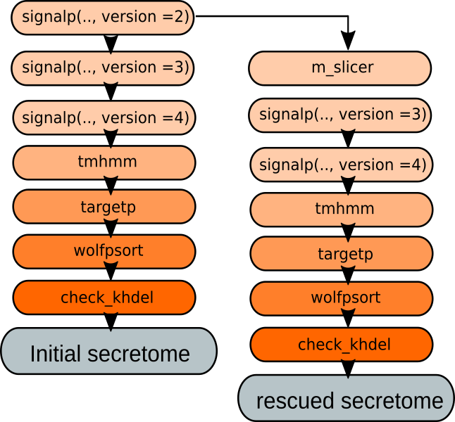

---
title: "SecretSanta: flexible pipelines for automated prediction of secreted proteins."
author: "Anna Gogleva"
date: "`r Sys.Date()`"
output: rmarkdown::html_vignette
vignette: >
  %\VignetteIndexEntry{Vignette Title}
  %\VignetteEngine{knitr::rmarkdown}
  %\VignetteEncoding{UTF-8}
bibliography: Santa.bib
fig_caption: yes
tables: true
---  
## 1. Background
**SecretSanta** provides an R interface aiding integrative prediction of 
extracellular proteins secreted via classical secretion pathway, i.e. requiring
presence of a signal peptide.

Secretome prediction often involves multiple steps. Typically it starts with prediction of short signal peptides at the N-terminus end of a protein
(**Figure 1, a-b**). Next, it is crucial to ensure the absence of motifs and domains preventing the protein from being secreted despite the presence of the signal peptide. These sequences include transmembrane domains, short ER 
retention signals, mitochondria and plastid targeting signals
(**Figure 1, c-e**). The ultimate aim of secretome prediction pipeline is to 
keep secreted proteins shown in **Figure 1, a-b** and filer out
those shown in **Figure 1, c-e**.

```{r figs2, out.width = "400px", fig.align="center", echo = FALSE, fig.cap="\\label{fig:figs1} **Figure 1.** Characteristic motifs, domains and their arrangemnets, helping to distinguish extracellular proteins from proteins retained inside the cell.", }
knitr::include_graphics("motifs_and_domains.png")
```

Though, a number of excellent command line tools and web-interfaces exist to perform prediction of individual motifs and signal sequences ([signalp](http://www.cbs.dtu.dk/services/SignalP/), [targetp](http://www.cbs.dtu.dk/services/TargetP/), [TMHMM](http://www.cbs.dtu.dk/services/TMHMM/), [WolfPsort](https://github.com/fmaguire/WoLFPSort)), the interface allowing to combine the outputs in a single flexible workflow is lacking.

\newline

**SecretSanta** package attempts to bridge this gap. It provides wrapper
functions around existing command line tools for prediction of signal peptides 
and protein subcellular localisation. The wrappers are designed to work
together. They produce an output in a standardized format recognizable by all
of them. This allows to pipe results between individual predictors easily to
create flexible custom pipelines as well as compare prediction results between similar methods: **targetp** and **WoLFPsort**; or multiple versions of 
**signalp**. To speed-up processing of large input fasta files initial steps of 
the pipeline are automatically run as embarrassingly parallel processes when the number of input sequences exceeds a certain limit. Taken together
**SecretSanta** provides tools aiding automation of multi-step secretome
prediction pipelines that can be applied to large protein sets to facilitate comparison of secretomes across multiple species.

\newline 

To avoid confusion, here and further, names of external command line tools will
be shown in **bold**, the corresponding R functions from the **SecretSanta** package will have standard ``code highlighting``, for example:

+ **signalp** - CBS signalp and its associated derivative files;
+ ```signalp``` - **SecretSanta** wrap function around **signalp**;

Majority of the **SecretSanta** functions could be run in 2 modes: 

+ ``starter`` - in the case you initiate secretome pipeline with the above
function;
+ ``piper`` - for downstream/intermediate steps, so that the function expects an
output from another wrapper function.

## 2. Installation of external dependencies

For prediction of secreted proteins SecretSanta relies on a set of existing
command line tools. Please install them and configure according to the listed 
instructions.
\newline

### 2.1 Download and configure external dependencies

#### Tools for prediction of signal peptides and cleavage sites:
- **signalp-2.0** 
    + This version can run under IRIX, IRIX64, Linux, OSF1, SunOS.
    + Download stand alone signalp2.0 http://www.cbs.dtu.dk/cgi-bin/sw_request?signalp+2.0
    + Unpack the archive
    ```{sh unpack signalp-2.0, eval=FALSE}
    tar -zxvf signalp-2.0.Linux.tar.Z
    cd signalp-2.0
    ```
    + Edit "General settings" at the top of the **signalp** file. Set value of 'SIGNALP' variable to be path to your **signalp-2.0** directory. Other variables usually do not require changes. We will not use plotting functions from signalp,
    so gnuplot, ppmtogif and ghostview are not required. For more details please check ``signalp-2.0.readme``.
    + Since, we want to be able to run different versions of **signalp**,
    including the legacy ones, it is important to be able to discriminate
    between them. R is oblivious to shell aliases, so we will simply rename the    **siganlp** script:
    
    ```{sh rename signalp2, eval = FALSE}
    mv signalp siganlp2
    ```

\newline

- **signalp-3.0** 
    + This version will run on the most common UNIX platforms.
    + Download stand alone signalp3.0 http://www.cbs.dtu.dk/cgi-bin/sw_request?signalp+3.0
    + Unpack the archive
    ```{sh unpack signalp-3.0, eval=FALSE}
    tar -zxvf signalp-3.0.Linux.tar.Z
    cd signalp-3.0
    ```
    + Similar to **signalp-2.0**, edit "General settings" at the top of the 
    signalp file. Set value of 'SIGNALP' variable to be path to your **signalp-3.0** directory. Other variables usually do not require changes. 
    For more details please check ``signalp-3.0.readme``.
    + Rename **signalp** script to avoid further confusion between the versions:
    ```{sh rename signalp3, eval = FALSE}
    mv signalp signalp3
    ```
    
\newline
 
- **signalp-4.1** - the most recent version
    + This version can run under Windows, OS X (Macintosh) and Linux.
    + Download stand alone signalp4.0 http://www.cbs.dtu.dk/cgi-bin/sw_request?signalp+4.0
    + Unpack the archive
    ```{sh unpack signalp-4.1, eval = FALSE}
    tar -zxvf signalp-4.1.Linux.tar.Z
    cd signalp-4.1
    ```
    + Edit "General settings" at the top of the **signalp** file. Set values for 'SIGNALP' and 'outputDir' variables. For more details please check ```signalp-4.1.readme```.
    + Rename **signalp** script to avoid further confusion between the versions:
    ```{sh rename signalp4, eval = FALSE}
    mv signalp signalp4
    ```

\newline

#### Tools for prediction of protein subcellular localisation:    
    
- **taretp-1.1**
    + **tatgetp-1.1** will run on the most common UNIX platforms  
    + Download stand alone targetp http://www.cbs.dtu.dk/cgi-bin/nph-sw_request?targetp
    + Unpack the archive:
    ```{sh unpack targetp-1.1, eval = FALSE}
    tar -zxvf targetp-1.1b.Linux.tar.Z 
    cd targetp-1.1
    ```
    + Edit the paragraph labeled "GENERAL SETTINGS, customize" at the top of 
    the **targetp** file.
    Set values for 'TARGETP' and 'TMP' variables. Ensure, that the path to
    **targetp** does not exceed 60 characters, otherwise **targetp-1.1** might fail.

\newline

- **WoLFPsort**
    + Clone WoLFPsort
    ```{sh, download WoLFPSort, eval = FALSE}
    git clone https://github.com/fmaguire/WoLFPSort.git
    cd WoLFPSort
    ```
    + Copy the binaries from the appropriate platform specific binary directory         ```./bin/binByPlatform/binary-?``` to ```./bin/```
    + For more details please check the ```INSTALL``` file.
    + The most important script we need **runWolfPsortSummary** has a bulky 
    name, we will rename it to simply **wolfpsort** for the future convenience:
    ```{sh rename wolf, eval = FALSE}
    mv runWolfPsortSummary wolfpsort
    ```

\newline

#### Tools for prediction of transmembrane domains
- **tmhmm-2.0**
    + **tmhmm-2.0** will run on the most common UNIX platforms  
    + Download stand alone tmhmm (http://www.cbs.dtu.dk/cgi-bin/nph-sw_request?tmhmm)
    + Unpack the archive:
    ```{sh, unpack tmhmm-2.0, eval = FALSE}
    tar -zxvf tmhmm-2.0c.Linux.tar.gz
    cd tmhmm-2.0c
    ```
    + Set correct path for Perl 5.x in the first line of ```bin/tmhmm``` and ```bin/tmhmmformat.pl``` scripts.
    + For more details please check the ```README``` file.
    

\newline


### 2.2 Oragnise acess to the external dependecies

Two options are possible:

#### Option A: all the external dependecies are accessible from any location.

This requires modification of ``$PATH`` environment variable. To make the change permanent, edit ``.profile``:

Open ./profile:
```{sh edit $PATH, eval = FALSE}
gedit ~/.profile
```

Add a line with all the path exports.
In this example all the dependencies are installed in the `my_tool` directory:
```{sh, eval = FALSE}
export PATH=
"/home/my_tools/signalp-4.1:\
/home/my_tools/signalp-2.0:\
/home/my_tools/signalp-3.0:\
/home/my_tools/targetp-1.1:\
/home/tmhmm-2.0c/bin:\
/home/my_tools/WoLFPSort/bin:\
$PATH"
```

Reload ``/.profile``:
```{sh, eval = FALSE}
. ~/.profile
```

Reboot, to make changes visible to R, alternatively - restart the R session.

#### Option B: paths to external dependencies are supplied in a separate file:
This option should be used when ``$PATH`` variable can not be modified. Create a 2-column space-separated text file with listed paths for all the external dependencies.  

```{r load SecretSanta, message=FALSE, echo = FALSE}
library(SecretSanta)
```

```{r paths example, echo = FALSE}
pp <-
  suppressMessages(readr::read_delim(
  system.file("extdata", "santa_paths",
  package = "SecretSanta"),
  delim = ' ',
  col_names = FALSE
  ))
  names(pp) <- c('tool', 'path')
  
  knitr::kable(pp,
               format='pandoc',
               caption = "**Table1**: Sample paths to external dependencies"
              )
```

For external tool names please use simple character strings without version numbers. The only exception here are different versions of **signalp**, which require version number in one-digit format in the first column to be distinguishable.


### 2.3 Check that all the required dependencies are installed correctly
```{r real load SecretSanta, message=FALSE}
library(SecretSanta)
```
```manage_paths``` function will run small test jobs and check that all the
external dependencies are functional.

In case all the dependencies are available globally (see **Option A**):
```{r check_paths_in_path, echo = TRUE, collapse = TRUE}
check1 <- manage_paths(in_path = TRUE)
```
It is also possible to run just a single test for a specific dependency in question:

```{r check_paths_in_path_single, echo = TRUE, collapse = TRUE}
check1 <- manage_paths(in_path = TRUE,
                       test_mode = 'signalp2')
```

In case we have paths organised in a separate file (see **Option B**):

```{r check_path_in_file, echo = TRUE, collapse = TRUE}
check2 <- manage_paths(
  in_path = FALSE,
  path_file = system.file("extdata",
  "sample_paths",
  package = "SecretSanta")
  )
```

Note, that ```manage_paths``` is case insensitive and will convert all the tool names to the lower case. 


## 3. Individual methods

### 3.1 Signalp

**signalp** is a software tool to predict classical signal peptides and 
cleavage sites [@Nielsen1997] in eukaryotes and bacteria. The method combines prediction of signal peptides and cleavage cites based on a combination of artificial neural networks as well as hidden Markov models. The latter allows
to distinguish between signal peptides and non-cleaved signal anchors.

Currently ```signalp``` function from SecretSanta provides an interface for the three recent versions of  **signalp**. The reason behind this is that
**signalp-4** and **signalp-4.1** are not sensitive enough to predict certain classes of secreted oomycete and fungal effectors [@Sperschneider2015]. Thus, providing access to the older versions provide greater flexibility for building versatile prediction pipelines for a wider taxonomic range of species.

- **signalp-2.0** [@Nielsen1998]
- **signalp-3.0** [@Bendtsen2004]
- **signalp-4.0** [@Petersen2011]

``signalp`` requires specifying ``organism`` parameter; possible values include:
- 'euk' - for eukaryotes;
- 'gram+' - for gram-positive bacteria;
- 'gram-' - for gram-negative bacteria.

To run signalp prediction, first read fasta file with amino acid sequences and store it's contents in a separate variable:
```{r read aa fasta, }
aa <- readAAStringSet(system.file("extdata",
                                  "sample_prot_100.fasta",
                                  package = "SecretSanta"))
```
Initialize object of CBSResult class with ```aa``` as ```in_fasta``` attribute.
```{r initialise CBSResult, cache=FALSE}
inp <- CBSResult(in_fasta = aa)
```
Since this is the first step in our secretome prediction pipeline, we will run ```signalp``` in a *starter* mode. Here we select version number 2
(**signalp-2.0**) and assume that signalp is accessible globally, so no path 
files should be specified.

```{r run signalp2,  collapse = TRUE, }
step1_sp2 <- signalp(inp,
                     version = 2,
                     organism = 'euk',
                     run_mode = "starter")
```

The above code under the hood will run **signalp-2.0** prediction and output
result as an instance of ```SignalpResult``` class, which is belongs to a more 
generic ``CBSResult()`` superclass.

```{r explain SignalpResult class}
class(step1_sp2)
slotNames(step1_sp2)
```

```SignalpResult``` object contains 5 slots:

+ ``in_fasta`` - original set of input amino acid sequences;

+ ``sp_tibble`` - parsed **signalp** tabular output for positive candidates;

+ ``out_fasta`` - full length amino acid sequences of positive candidates;

+ ``mature_fasta`` - mature sequence for the candidate secreted proteins, i.e 
sequences with removed N-terminal signal peptides;

+ ``sp_version`` - version of **signalp** used.

You can use accessor methods to access contents of individual slots:

```{r get input fasta}
getInfasta(step1_sp2)
```
Please note, that by default ``signlap`` truncates all the input sequences longer
than 2000 a.a, in this case '_truncated' is added to the original sequence ids
to keep track of the changes. Alternative option - is discard long sequences
completely before the analysis, to do so set ``truncate = FALSE`` when running ``signalp``.

```{r showcase all other accessors for SignalpResult object}
getSPtibble(step1_sp2)
getOutfasta(step1_sp2)
getMatfasta(step1_sp2)
getSPversion(step1_sp2)
```

Next, imaging we would like to run all the **signalp** version on the same input
for comparison. To do so, simply change ``version`` parameter:

```{r run signalp3 and 4, collapse = TRUE, }
step1_sp3 <- signalp(inp,
                     version = 3,
                     organism = 'euk',
                     run_mode = "starter")
step1_sp4 <- signalp(inp,
                     version = 4,
                     organism = 'euk',
                     run_mode = "starter")
```
In this case ``signalp-4.1`` version resulted in fewer number of candidates. 
Please note, that despite differences in the output format generated by multiple 
versions of **signalp**, ``signalp`` returns ``sp_tibble`` in a standard format.

In order to pipe result from different versions of **signalp** just switch to
the ``run_mode = 'piper'`` for the second and other downstream steps. In this
case ``signalp`` will run the analysis using contents of ``out_fasta`` slot as an input. Say, we want to do the following piping: **signalp2** -> **signalp3** -> **signalp4**.
We will re-use ``step1_sp2`` object generated earlier in the ``starter`` mode
and use it as an input for the next step:

```{r signalp piper sp2->sp3, collapse = TRUE}
step2_sp3 <- signalp(step1_sp2,
                     version = 3,
                     organism = 'euk',
                     run_mode = "piper")
```

Similar with the **signalp3** -> **signalp4** piping:

```{r signalp piper sp3 -> sp4, collapse = TRUE}
step3_sp4 <- signalp(step2_sp3,
                     version = 4,
                     organism = 'euk',
                     run_mode = "piper")
```

With the input fasta files containing more than 1000 sequences,``signalp`` will automatically switch parallel mode: will split the input into smaller chunks and
will run prediction as an embarrassingly parallel process using all the CPUs
available. Accurate execution time depend on the number if CPUs available and 
the input file size. With 48 CPUs it takes ~2 minutes to run ``signalp`` on the
input fasta file with more than 40'000 sequences.

### 3.2 TMHMM
**TMHMM** predicts transmembrane a-helices and helps to identify integral
membrane proteins based on HMMs [@Krogh2001; Sonnhammer1998]. It is important to 
exclude proteins with trans membrane domains locates after signal peptide, as
they will be retained in the membrane. Quite often **TMHMM** is not able to
distinguish between N-terminal signal peptides and transmembrane domain. So, it
is better to run it on the mature sequences with signal peptides removed.
``tmhmm`` function can handle input objects of SignalpResult class with 
non-empty ```mature_fasta``` slot (see starters and pipers table for allowed inputs).

Here we will use output of the ``signalp`` function as an input:

```{r tmhmm legal, collapse=TRUE, cache=FALSE}
tm <- tmhmm(step1_sp2, TM = 0)
```
Attempts to run ``tmhmm`` on the ``CBSResult`` object lacking ``mature_fasta`` 
slot will result in an error:

```{r tmhmm illegal, collapse=TRUE, error=TRUE}
tm2 <- tmhmm(inp, TM = 0)

```
``tmhmm`` outputs instances of ``TMhmmResult`` class, again inheriting from 
``CBSResult``.

```{r explain TMhmmResult class}
class(tm)
slotNames(tm)
```

``TMhmmResult`` object contains 5 slots:

+ ``in_fasta`` and ``out_fasta`` are common attributes of all classes 
inheriting from CBSResult class;

+ ``tm_tibble`` - parsed **tmhmm** tabular output for candidates not having more transmembrane domains than specified by ``TM`` threshold;

+ ``in_mature_fasta`` - mature sequences used as an input for ```tmhmm```

+ ``out_mature_fasta`` - outputted mature sequences not having more transmembrane domains than specified by ``TM`` threshold.

To access individual slots you could use accessor functions:

```{r accessors for TMhmmResult class}
getTMtibble(tm)
getInMatfasta(tm)
getOutMatfasta(tm)
```


### 3.3 Targetp
**Targetp** predicts subsellular localisation of secreted eukaryotic proteins
based on the presence of signal peptide (SP), chloroplast transit peptide (cTP)
or mitochondrial targeting peptide (mTP) in the N-terminus [@Emanuelsson2008]. 
Including **targetp** in the pipeline can provide additional evidence that a 
protein with a predicted signal peptide is no targeted to plastids or
mitochondria and is indeed extracellular. ``targetp`` function accepts input
objects belonging to the ``CBSResult`` class.

``targetp`` requires specifying ``network_type`` to run correctly. Possible 
values include:

- 'P' - for plants;
- 'N' - for non_plants.

It is possible to run ``targetp`` in both *piper* and *starter* modes.
Imagine, we want to start our pipeline by running ``targetp`` using already
created ``inp`` object as an input:

```{r tatgetp starter, collapse = TRUE, cache=FALSE}
tp <- targetp(inp,
        network = 'N',  # for non-plant networks
        run_mode = 'starter')
```

Alternatively, we can run targetp on the output of other functions, for example ``signalp`` in the *piper* mode:

```{r targetp piper, collapse = TRUE, cache=FALSE}
tp_pipe <- targetp(step1_sp2,
                   network = 'N',
                   run_mode = 'piper'
        )
```

In both cases ``targetp`` will output an object of ``TargetpResult`` class with 
the following slots:

```{r explain TargetpResult class}
class(tp)
slotNames(tp)
```

+ ``in_fasta`` and ``out_fasta`` are common attributes of all classes 
inheriting from ``CBSResult`` class;
+ ``tp_tibble`` - parsed tragetp tabular output for candidates not targeted
to mitochondria or plastids, i.e most likely to be secreted.

To access ``tp_tibble`` slot use ``getTPtibble`` method:
```{r access tp_tibble}
getTPtibble(tp)
```

``targetp`` will automatically switch to a parallel mode if number of input sequences is grater than 1000.

### 3.4 WoLFPSORT
**WoLFPSORT** - predicts protein subcellular localisation based on PSORT
principle. It converts amino acid sequences into numerical localisation features based on sorting signals, amino acid composition and functional motifs. The converted data is then classified based on k-nearest neighbor algorithm [@Horton2006].

``wolfpsort`` requires ``organism`` parameter, it's possible values include:

- 'plant';
- 'animal';
- 'fungi'.

``wolfpsort`` function accepts objects of ``CBSResult`` class with non-empty
``out_fasta`` slot, so it is recommended to run this prediction on later stages 
of the pipeline.

```{r run wolfpsort, collapse = TRUE, cache=FALSE}
wlf <- wolfpsort(step1_sp2,
                 organism = 'fungi')

```

``wolfpsort`` returns an object with 3 slots:

```{r explain WolfpsortResult class}
class(wlf)
slotNames(wlf)
```
+ ``in_fasta`` and ``out_fasta`` are common attributes of all classes 
inheriting from ``CBSResult`` class;
+ ``wolf_tibble`` - parsed wolfPsort tabular output for sequences with 
'extracellular' predicted to be the most probable subcellular localisation.

To access contents of ``wolf_tibble`` slot use ``getWOlFtibble`` method:
```{r access wolf_tibble}
getWOLFtibble(wlf)
```

Since ``wolfpsort`` has the same purpose as ``targetp`` it might be useful to
run these functions side by side and compare the obtained results (see [targetp results](#Targetp)).

### 3.5 Check the presence of terminal ER-retention motifs
In addition to having signal peptides some proteins might have ER-retention 
signal in the C-terminal domain, preventing protein from being secreted outside 
the cell. There are at least 2 known ER-retention motifs ('KDEL' and 'HDEL') 
[@Munro1987].

The ``check_khdel`` function uses simple pattern matching to scan amino acid
sequences and remove those with ER retention signal in the C-terminus. To run
it, simply pass a ``CBSResult`` object as an input.  You can run it in either *piper* or *starter* mode. The function does not rely on external dependencies,
so providing path container is not required.

```{r check ER retention, collapse = TRUE, cache=FALSE}
er_result <- check_khdel(step1_sp2,
                         run_mode = 'piper')

```
This will return and object with 3 slots:

```{r explain ErResult class}
slotNames(er_result)
```
+ ``in_fasta`` and ``out_fasta`` are common attributes of all classes 
inheriting from ``CBSResult`` class;
+ ``retained`` - all the sequences with C-terminal '(K/H)DEL' motifs, in case you
would like to have a look at them.

### 3.6 M-slicer

This is an experimental option. ``m_slicer`` function takes the input amino acid
sequences and generates all possible subsequences starting with methionine based
on the assumption that translation start sites might be mis-predicted in the 
original set of proteins -> signal peptides might be also mis-predicted. Output 
of this step can be used as an input for secretome prediction pipeline to rescue
secreted proteins with mis-predicted start sites. Sequence ids for the newly 
generated slices are  build by concatenating original sequence id, 'slice' 
string and position of the Methionine sliced from. For example: ``ALI_PLTG_3_slice_M86`` 
means that ``ALI_PLTG_3`` sequence was sliced starting from methionine in the 
position 86.

``m_slicer`` has 2 running modes:

+ ``slice`` - to simply slice input fasta regardless of it's origin;

```{r m_slicer slice, cache=FALSE}
slice <- m_slicer(aa,  # a set of amino acid seqeunces
                  run_mode = 'slice',
                  min_len = 100 # minimal length of the outputed slices
)
```

+ ``rescue`` - having output from any other up-stream function it extracts 
proteins not predicted to be secreted on the initial run and generate slices for them.

```{r m_slicer rescue, cache=FALSE}
rescued <- m_slicer(step1_sp2,  # signalp2 output
                  run_mode = 'rescue',
                  min_len = 100
)

```

Results of both run modes could be used as an input for other ``SecretSanta`` 
predictors. Say, we want to run ``signalp`` on the rescued proteins. Note, that ``m_slicer`` outputs ``AAStringSet`` objects, so in order to pass it to
``signalp`` we first need to create ``CBSResult`` object with ``in_fasta = rescued``.

```{r signalp for rescued proteins, collapse = TRUE, cache=FALSE}
r_inp <- SignalpResult(in_fasta = rescued)
sp_rescue <- signalp(r_inp,
                    version = 2,
                    organism = 'euk',
                    run_mode = 'starter',
                    truncate = TRUE)
```
The slicing procedure returned 15 additional potentially secreted candidates.

## 4. Pipers and/or starters

Here is a short summary:

```{r starters_pipers, echo = FALSE}
st <- suppressMessages(readr::read_delim(system.file("extdata",
                                    "summary_tools.csv",
                                    package = 'SecretSanta'),
                        delim = ','))

knitr::kable(st, align = c(rep('c', 2), 'l', rep('c',3)))
```

## 5. Build pipelines, simple workflow

Now, we want to build a pipeline using all our available functions. Say, we 
would like to have a relatively short one with the following steps:

+ use **signalp4** to predict signal peptides and cleavage sites;
+ run **tmhmm** on the output, to ensure that predicted proteins with
signal peptides do not contain TM domains, i.e won't be stuck in the membrane;
+ run **targetp** on the output, to make sure that a set of selected proteins     is no targeted to plastids or mitochondria;
+ collect the targtep output and scan for ER-retention signals - to ensure
that proteins are not stuck in ER.

Now we will run it using ``SecretSanta`` functions, starting with ``aa`` - an
``AAStringSet`` object with 100 amino acid sequences in it, we will also reuse
``santa_paths`` created earlier:

#### Step 1: predict signal peptides

```{r, collapse = TRUE}
input <- CBSResult(in_fasta = aa)

input
step1_sp4 <- signalp(input,
                     version = 4,
                     organism = 'euk',
                     run_mode = 'starter',
                     truncate = TRUE
                     )

getSPtibble(step1_sp4)

getOutfasta(step1_sp4)

getMatfasta(step1_sp4)
```

***
> **Result**: 5 candidate proteins with signal peptides.

#### Step 2: check for presence of TM domains in mature peptides:

```{r, collapse = TRUE}
step2_tm <- tmhmm(step1_sp4,
                  TM = 0) # we allow 0 TM domains in mature peptides

getTMtibble(step2_tm)

getOutfasta(step2_tm)

getOutMatfasta(step2_tm)

```

***
> **Result**: 5 candidate proteins with signal peptides; 0 TM domains in
mature sequences.

#### Step 3: predict sub-cellular localisation
Here we are using ``targetp``, could have also used ``wolfpsort``.

```{r, collapse=TRUE}
step3_tp <- targetp(step2_tm,
                         network = 'N',
                         run_mode = 'piper')

getTPtibble(step3_tp)

getInfasta(step3_tp)

getOutfasta(step3_tp)
```

This step allowed us to filter 1 sequence potentially targeted to mitochondria.

> **Result**: 4 candidate proteins with signal peptides; 0 TM domains in
mature sequences; not targeted to plastids or mitochondria.

#### Step 4: check for ER-retention signals

```{r, collapse = TRUE}
step4_er <- check_khdel(step3_tp,
                        run_mode = 'piper')

getOutfasta(step4_er)
```

***
> **Final Result**: 4 candidate proteins with signal peptides; 0 TM domains in
mature sequences; not targeted to plastids or mitochondria; not retained in ER.

This is an example of a fairly simple pipeline, but you can create more complex ones. The stringent pipeline might look like this and involve stringent 
filtration on signal peptide prediction as well as additional predictions for 'rescued' proteins:

```{r, out.width = "300px", fig.align="center", echo = FALSE}

```

### References